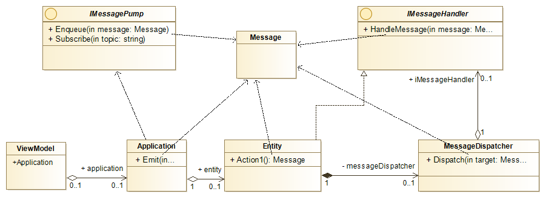
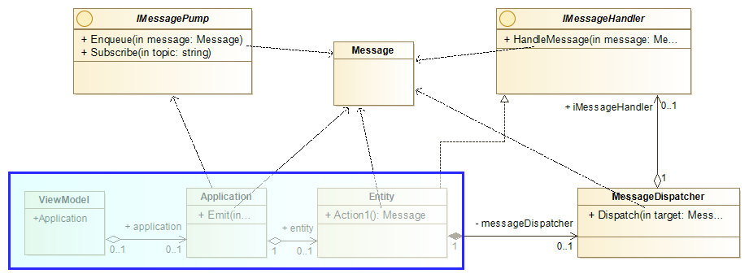
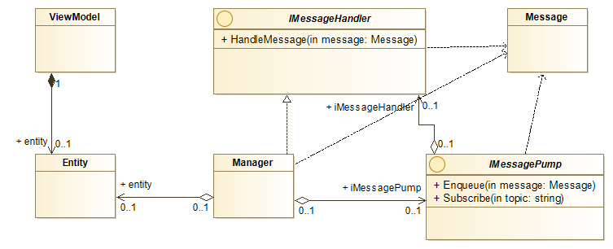
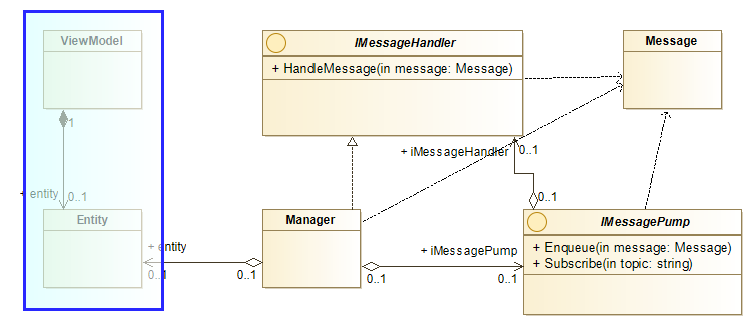

# Partially Ordered Facts

The Partially Ordered Facts or (PoF) library is an attempt at implementing the Historical Modelling idea while following principles of clean architecture, especially the need to keep any frameworks at arms length. 

## Introduction

### Historical Modelling

I have first heared about from a Pluralsight course [Occasionally Connected Windows Mobile Apps: Collaboration](https://www.pluralsight.com/courses/occasionally-connected-windows-mobile-apps-collaboration) by [Michael L. Perry](https://github.com/michaellperry) and still after 5 years since that course is a very good introduction to the concept, despite the fact that is shown on an example of Windows Phone 7 application. 

As explained by the author on [Modeling.com](https://modeling.com) Historical Modelling "is based on a model of software behavior as a graph of partially ordered facts". Unlike with distributed event sourcing system where the messages have to ordered historical modelling requires only partial ordering. 

### Original Implementations

Original implementations can be found in a number of Michael's projects [Jinaga](https://github.com/michaellperry/jinaga), [Correspondence](http://correspondencecloud.com/) and [Mathematicians](https://github.com/michaellperry/Mathematicians) which he calls a 'reference implementation'.

There is plenty information in the links provided above to look at the details of the original implementations, but for the purpose of discussing proposed improvements here is a view at some key elements and their dependencies. 

The `Message` object is all present. Any entity modelled (`Entity` on the diagram) has to implement `IMessageHandler` and cannot directly modify its own state, but rather to perform an action (e.g. `Action1`) it has to create a message which then in the `ViewModel` it is passed to the `Application` object, which in turn _emits_ the message which eventually arives back to the `Entity` updating its state. To support more complex entities each root entity has to hold a reference to a `MessageDispatcher`. 

Most of the elements necessary to make it work can be delivered by library, but it doesn't change the fact that specific project elements including the `ViewModel`, `Application` and `Entity` all have to be aware of and excluding the `ViewModel` depend on the historical modelling components. Entities have to be `IMessageHandlers` and be able to create `Message` instances while the application components are responsible for the orchestration of the `Message` exchanges. 

Above: Domain specific components which unnecessarily depend on historical modelling concepts and components. 

### Another Approach

While the concept is very interesting and has been at the back of my mind for the last 5 years, every time I attempted to do somethinig with it very quickly I got discurrage by how invasive this approach is. It never found a way to simply add it to an existing project, without changing much more than I would want to. 

In the above, proposed implementation the key element provided by the library is an entity `Manager` which is an implementation of `IMessageHandler` and has dependencies on `Message` and `IMessagePump` but doesn't need to know anything about the `Entity` as reflection is used to manage an entity. 

As shown above none of the domain specific classes (`Entity` or `ViewModel`) have any dependency on any aspect of historical modelling, which is used behind the scenes to manage the object synchronisation between devices. 

It might be necessary for some part of the domain specific classes to be aware of the historical modelling concepts to manage conflicts, but it might also be possible to implement some sort of automatic conflict resolution, but this architecture should allow to add benefits of historical modelling to an existing system regardless of how it is implemented right now. 

*This repository is attempt at trying to see if there is another way, one that would allow to have a library that allows to add historical modelling to any existing codebase as an extra, rather than as an architectural principle.*

## Initial Requirements

1. Entity objects should not depend on any framework.
2. It should be possible to add historical modelling like synchronisation to existing application with minimal disruption. 
3. Where possible strong typing should be chosen over dynamic / expando objects.

## Things to consider

* Automatic conflict resolution
* Selective property attechment