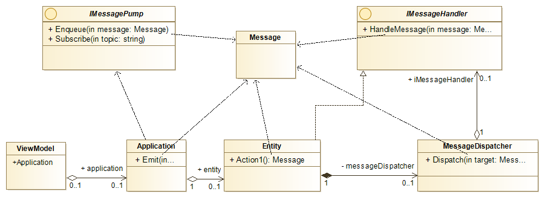
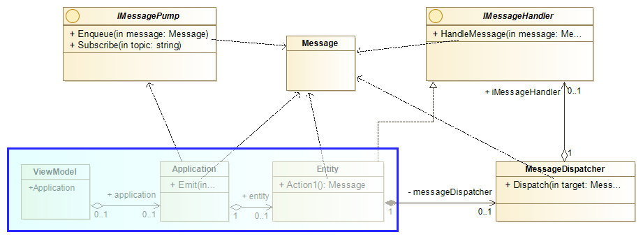
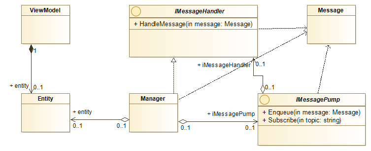
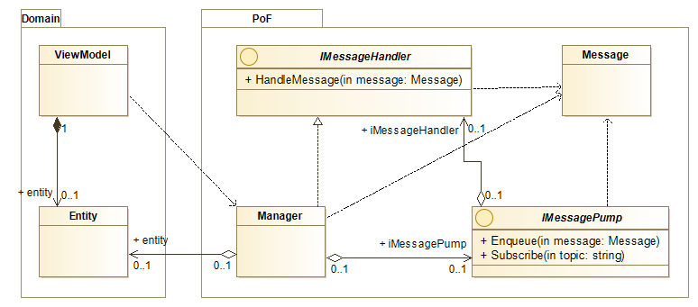

# Partially Ordered Facts

The Partially Ordered Facts (better name is needed) library is an attempt at implementing the Historical Modelling idea while following principles of clean architecture, especially the need to keep any frameworks at arms length. 

## Introduction

### The Concept

I have first heared about Historical Modelling from a Pluralsight course [Occasionally Connected Windows Mobile Apps: Collaboration](https://www.pluralsight.com/courses/occasionally-connected-windows-mobile-apps-collaboration) by [Michael L. Perry](https://github.com/michaellperry) and still after 5 years since that course is a very good introduction to the concept, despite the fact that is shown on an example of Windows Phone 7 application. 

As explained by the author on [Modeling.com](https://modeling.com) Historical Modelling "is based on a model of software behavior as a graph of partially ordered facts". Unlike with distributed event sourcing system where the messages have to ordered historical modelling requires only partial ordering. 

### Practical Application

Historical modelling with only partially ordered facts is an appealing concept for distributed applications where the users or their devices are only occasionally connected and where they concurrently work on the same documents or data structures. Things like google docs, office 365 are obvious examples of application allowing such collaboration, and concurrent co-editing of documents. But simpler applications could benefit from this type of functionality too. 

See the [Project Ideas](./docs/ProjectIdeas.md) for more details about what sort of problems could be solved with this library and for the details of a planned demo / reference project. 

## Original Implementations

Original implementations can be found in a number of Michael's projects [Jinaga](https://github.com/michaellperry/jinaga), [Correspondence](http://correspondencecloud.com/) and [Mathematicians](https://github.com/michaellperry/Mathematicians) which he calls a 'reference implementation'.

There is plenty information in the links provided above to look at the details of the original implementations, but for the purpose of discussing proposed improvements here is a view at some key elements and their dependencies. 

The `Message` object is all present. Any entity modelled (`Entity` on the diagram) has to implement `IMessageHandler` and cannot directly modify its own state, but rather to perform an action (e.g. `Action1`) it has to create a message which then in the `ViewModel` it is passed to the `Application` object, which in turn _emits_ the message which eventually arives back to the `Entity` updating its state. To support more complex entities each root entity has to hold a reference to a `MessageDispatcher`. 

Most of the elements necessary to make it work can be delivered by library, but it doesn't change the fact that specific project elements including the `ViewModel`, `Application` and `Entity` all have to be aware of and excluding the `ViewModel` depend on the historical modelling components. Entities have to be `IMessageHandlers` and be able to create `Message` instances while the application components are responsible for the orchestration of the `Message` exchanges. 

Above: Domain specific components which unnecessarily depend on historical modelling concepts and components. 

## Another Approach

While the concept is very interesting and has been at the back of my mind for the last 5 years, every time I attempted to do somethinig with it very quickly I got discurrage by how invasive this approach is. It never found a way to simply add it to an existing project, without changing much more than I would want to. 

There are many alterntives and some of them are discussed [here](./Alternatives.md). The one below is one depending on a model with publically available properties, a very Microsoft way to deal with models and one that does not do encapsulation well. But here it is for now. 

In the above, proposed implementation the key element provided by the library is an entity `Manager` which is an implementation of `IMessageHandler` and has dependencies on `Message` and `IMessagePump` but doesn't need to know anything about the `Entity` as reflection is used to manage an entity. 

As shown above none of the domain specific entities have any dependency on any part of historical modelling and only the view model, or any other application layer needs to be aware of the `Manager` implementation. It could be possible to make everything but the manager to an internal type. 

It might be necessary for some part of the domain specific classes to be aware of the historical modelling concepts to manage conflicts, but it might also be possible to implement some sort of automatic conflict resolution, but this architecture should allow to add benefits of historical modelling to an existing system regardless of how it is implemented right now. 

*This repository is attempt at trying to see if there is another way, one that would allow to have a library that allows to add historical modelling to any existing codebase as an extra, rather than as an architectural principle.*

## Entity and Historical Models

In the proposed solution the entity doesn't need to handle or emit messages. In fact, it shouldn't to avoid dependencies on the historical model concepts, and the need to modify entities of the existing models. This complicates the lifecycle and property synchronisation of the entity. 

### Synchronising two objects locally

The `ViewModel` should instantiate an `Entity` and a `Manager` for that `Entity`. The `Entity` is then attached to the `Manager`, and through it to the _plumbing_ via `IMessagePump` implementation. 

Unless other actions are performed, the `Manager` should assume the entity to be in a default, or template state and don't emit any messages yet. But it should request any local or remote historical model for the topic chosen.

A template object can be _saved_ which should generate messages for all managed properties and from now on the conflicts should be resolved, but until this happens, any incoming messages from local or remote storage should freely override curent property values. 

Manager should maintain lifecycle of an Entity, from a default, to local and remote synchronised. Further it should be possible to pause, or detect problems with remote synchronisation and perhaps have an keep-alive type of a message, to help inform the user about how many synchronised objects are active, but that will be a more advanced feature considered more later. 

## Further Reading

### Historical Modelling

### This Project

 * [Requirements](./docs/Requirements.md)
 * [Other](./docs/Other.md)

