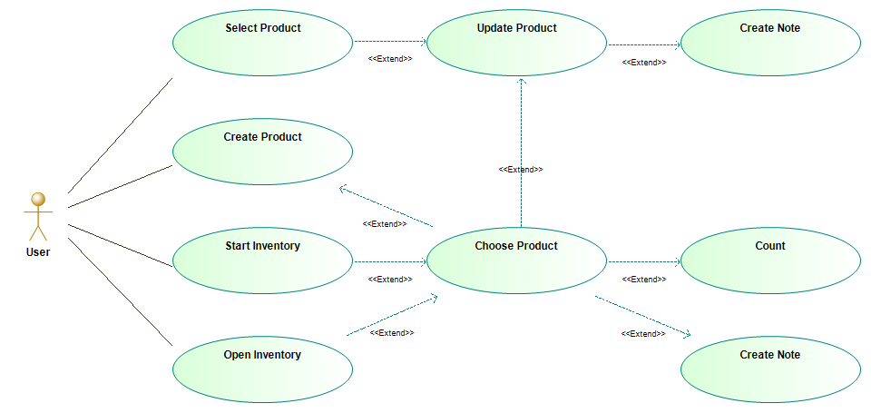

# Occasionally Connected Inventory Application

## The Test Scenario

Multiple users are tasked to do an inventory of a warehouse using mobile devices where the network connectivity is intermittent at best. They count the proudcts they found creating them in the system if they don't exist, but as they are not very organised sometimes they count or even create the same product concurrently while offline. 

## Use Cases

Each user opens the application and can start with one of 4 actions: create new product, select an existing product, start a new inventory, or open an existing inventory. When in an inventory any user can choose a product and provide the count of that product, or create a note. 

When all users are on-line then they each should see the changes made by the others, but when they go off-line they should still be able to create, update and count products with changes merged later into a single consistent data set.

## Domain Model

As it is just a demo project, it is not necessary to make it feature reach. The model is intentially as simple as possible with no authorisation, auditing, user registration, ability to manage or delete users, delete inventories or products. The model needs to be only complex enough to allow demonstration of synchronisation and conflict resolution between properties of a model tree including different data types (both simple and complex), aggregates and compositions.

